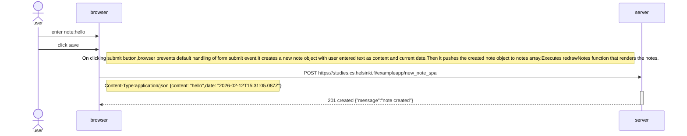

```mermaid
sequenceDiagram
    actor user
    participant browser
    participant server

    user->>browser:enter note:hello
    user->>browser:click save

    Note right of browser:On clicking submit button,browser prevents default handling of form submit event.It creates a new note object with user entered text as content and current date.Then it pushes the created note object to notes array.Executes redrawNotes function that renders the notes.

    browser->>server: POST https://studies.cs.helsinki.fi/exampleapp/new_note_spa

    Note right of browser: Content-Type:application/json {content: "hello",date: "2026-02-12T15:31:05.087Z"}
    
    activate server
    server-->>browser: 201 created {"message":"note created"}
    deactivate server
```